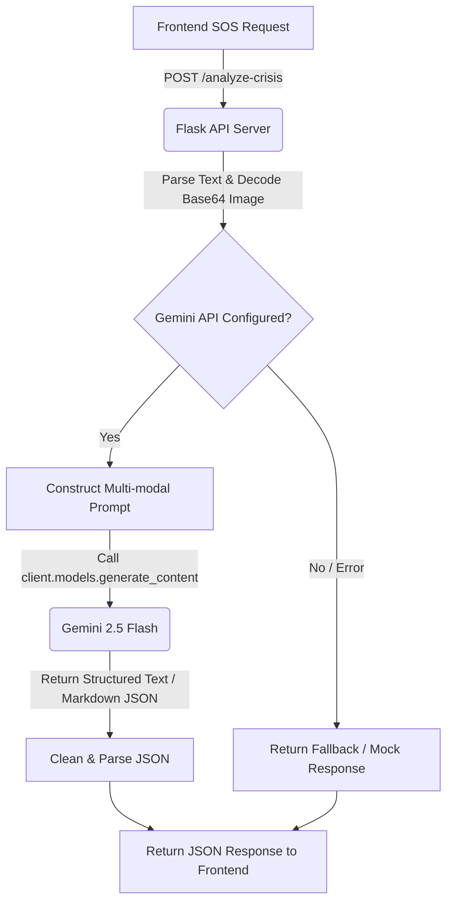

# ⚡ EchoSync Backend - AI Crisis Classification Engine

This is the backend service for **EchoSync**, a real-time, AI-driven hospitality crisis management hub. Built using **Python (Flask)** and the official **Google GenAI SDK**, it acts as the intelligence layer of the system by processing guest SOS alerts using **Gemini 2.5 Flash**.

The backend automatically classifies the severity of incoming alerts, extracts actionable recommendations, translates messages from any language into English, and handles multi-modal inputs (text + images) to provide security personnel with instant, structured situational awareness.

---

## 🛠️ Tech Stack & Dependencies

The backend is built with a minimal, high-performance Python stack:
- **[Flask (v3.0.3)](https://flask.palletsprojects.com/)**: Lightweight WSGI web application framework.
- **[Flask-CORS (v4.0.1)](https://flask-cors.readthedocs.io/)**: Handles Cross-Origin Resource Sharing (CORS) to securely connect with the frontend.
- **[google-genai (v0.6.0)](https://github.com/google/generative-ai-python)**: The official SDK for interacting with Gemini models.
- **[python-dotenv (v1.0.1)](https://saurabh-kumar.com/python-dotenv/)**: Loads environment variables from a `.env` file.
- **[Gunicorn (v22.0.0)](https://gunicorn.org/)**: WSGI HTTP Server for production deployment.

---

## 🏗️ Architecture & Request Flow



1. **Client Request**: The frontend sends a POST request containing user-reported text and optional base64 image data.
2. **Preprocessing**: The server decodes any base64 image into raw bytes and wraps them into a GenAI `Part` block.
3. **AI Inference**: The backend queries the `gemini-2.5-flash` model with a structured, strict JSON-only system instruction.
4. **Parsing**: The API cleans the markdown blocks (e.g., ` ```json `) returned by the model and verifies that the output is valid JSON before returning it.

---

## ⚙️ Environment Variables

The backend relies on the following environment variables configured in a `.env` file:

```env
GEMINI_API_KEY="your-gemini-api-key-here"
```

> [!IMPORTANT]
> If `GEMINI_API_KEY` is not present, invalid, or client initialization fails, the server will operate in a **Mock/Fallback mode**, returning static high-priority alerts to prevent application crashes.

---

## 🚀 Local Development Setup

### Prerequisites
- Python 3.9 or higher installed on your system.

### Steps

1. **Navigate to the Backend Directory**:
   ```bash
   cd echosync-backend
   ```

2. **Create a Virtual Environment**:
   ```bash
   python -m venv venv
   ```

3. **Activate the Virtual Environment**:
   - **Windows (Command Prompt)**:
     ```cmd
     venv\Scripts\activate.bat
     ```
   - **Windows (PowerShell)**:
     ```powershell
     .\venv\Scripts\activate
     ```
   - **macOS / Linux**:
     ```bash
     source venv/bin/activate
     ```

4. **Install Dependencies**:
   ```bash
   pip install -r requirements.txt
   ```

5. **Run the Development Server**:
   ```bash
   python app.py
   ```
   The application will start running on **`http://127.0.0.1:5000`** in debug mode.

---

## 🌐 API Reference

### `POST /analyze-crisis`

Analyzes text and/or images submitted by a guest to classify the crisis.

- **URL:** `/analyze-crisis`
- **Method:** `POST`
- **Headers:**
  - `Content-Type: application/json`

#### Request Body
```json
{
  "message": "There is a guest who has collapsed in the hallway near room 304.",
  "image_data": "data:image/jpeg;base64,/9j/4AAQSkZJRgABAQEASABIAAD..."
}
```
*Note: Both parameters are optional, but at least one of them (`message` or `image_data`) must be provided.*

#### Response (Success - Status Code: `200 OK`)
```json
{
  "priority": "Critical",
  "action": "Dispatch Medical Team immediately to room 304",
  "english_translation": "There is a guest who has collapsed in the hallway near room 304.",
  "language_code": "en"
}
```

#### Fields Description
| Field | Type | Description |
| :--- | :--- | :--- |
| `priority` | `string` | Categorization level of the emergency (`Critical`, `High`, `Medium`, or `Low`). |
| `action` | `string` | A highly concise action plan for emergency response staff (maximum 10 words). |
| `english_translation` | `string` | English translation of the guest's message (returns original text if already in English). |
| `language_code` | `string` | Detected 2-letter ISO language code of the incoming message. |

#### Error Responses
- **400 Bad Request**: When neither `message` nor `image_data` is provided.
  ```json
  {
    "error": "No message or image provided"
  }
  ```
- **Fallback Recovery (200 OK)**: If Gemini analysis fails, the API gracefully recovers and returns a fallback structure:
  ```json
  {
    "priority": "High",
    "action": "Needs immediate review",
    "english_translation": "Translation failed. Please review original message.",
    "language_code": "unknown"
  }
  ```

---

## 🤖 Gemini Prompt Logic

The backend instructs the model to follow a strict role and response schema. Here is the template used under the hood:

```text
You are an advanced emergency response AI for a hospitality crisis management system.
Analyze the following message (and attached image if provided) from a guest and determine:
1. The Priority Level (Strictly choose one: 'Critical', 'High', 'Medium', or 'Low').
2. A brief, actionable Recommended Action for the staff or responders (maximum 10 words).
3. Detect the language of the guest's message and return the 2-letter ISO code.
4. Provide a clear English translation of the guest's message. If it is already in English, return the original message.

Guest Message: "{message}"

Respond ONLY in valid JSON format with the keys: "priority", "action", "english_translation", and "language_code".
```

---

## 🛡️ Production Deployment

For production environments, the app is configured to use **Gunicorn** as a WSGI HTTP server:

```bash
gunicorn -w 4 -b 0.0.0.0:5000 app:app
```
*(Render, Heroku, or other platforms can run the above command automatically based on the configurations.)*
